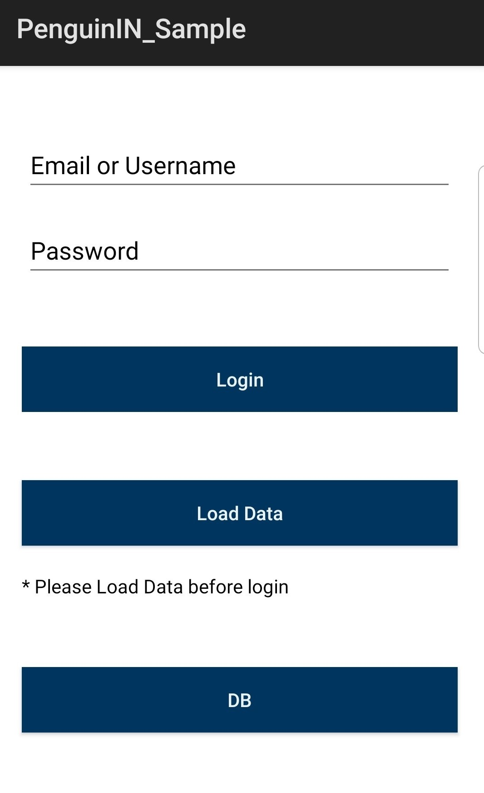

## Android Documentation - v4.0.0

[TOC]

# SDK and Sample Application Delivery 

At the bottom of this page, you will a link to download the SDK as a **.aar** file and the sample application as a build-able source code to generate the required **.apk** file. This file can be integrated in Android Studio via Gradle file. Please note that the .aar file needs to be integrated into Lib \(Library) folder, then in the project Build.gradle file.

# Sample Application  

The sample application has two modes of operation: (1) simulation mode and (2) live mode. In simulation mode, the application runs a pre-configured scenario with predetermined list of positions. In live mode, the position is fetched from the position engine services and of course requires complete BLE beacon roll-out and site calibration data to have been completed. In both modes, connectivity to the position engine service and the presence of at least one BLE beacon is required.

The steps below explain how to run the sample application.

- Install Sample App and Grant all permissions Manually:

   
           

- Run the sample app, and then click on Load Data:
   
     
     
     
     

- Make sure that the data is loaded to the SQLite tables.
   
     
     

- After Loading data successfully, click on Login button.

- After login, the map appears with the blue dot that shows the current user location. This is blue dot is based on a simulated position.
   
     
     

  A single hardcoded and highlighted POI has defined to demonstrate the navigation example. Simply click on the highlighted POI zone on the map and click on start navigation.
   

# SDK and Sample App Configuration

It is likely that during the development cycle, parameters for the SDK and the sample application will change.  To change the **SDK configuration** from SDK folder open the com.penguinin_sampleUtil/SDKParameters, and you can start modifying the following parameters:

- Data Server IP.
- Data Service Name.
- Position Server IP.
- Position Service Name.
- Fix Venue Value.
- Use Https Connections Flag:
  - True: Https.
  - False: Http.
- Simulation Mode flag: 
  - True: Simulation scenarios run.
  - False: Live BLE scan run.
- Support Multi Floor Flag:
  - True: Use Multi Floor configurations.
  - False: Use Single Floor configurations.

To change the **PoI Data** from Sample app folder open the com.penguinin_sampleData.Model.PoI\POI \Contructor, and you can start modifying the following paramters:

- ID.

- Floor ID.

- Name.

- Description

- Zone Points.

  **Two different definitions for multi and single floor**
     
     
     

To change the **Username** from Sample app folder open the o	com.penguinin_sample\MainActivity\onCreate, and you can start modifying the following:

- Username for live mode.

- Username for simulation multi floor mode.

- Username for simulation single floor mode.

   
   

# SDK: Methods and Integration 

In this section we present the methods availed to the application developer through our SDK followed by best practices to integrate it within a mobile application. 

 

## Initialize
Returns initialization success or failure as Boolean value.
 

### Operation
These steps describe the process of initialization:

 * Validate OS support and server connectivity.
 * Initialize input sources for positioning platform.
 * Detect current venue and get venue data \(will use data API):
    * Venue specific positioning information
    * Floors details
    * Edges details
 * Perform device specific calibration
 * Establish connectivity requirements.
 * Save the results and Log for analytics \(if supported)
 

### Parameters
| Parameters | Description | Value Type |
|:---|:---|:---:|
| UserID | Front End UserID | String |
| IPList | Penguin Data API IP address \(mandatory) Penguin Position API IP address \(mandatory) Third party API IP address \(optional) | List(String) |
| context | App main context | Context |
| activity | App main activity | Activity |
| UseNoneIMU | Enable Just JAR None IMU calculation | Boolean |
 

### Response
| Value | Description | Value Type |
|:---|:---|:---:|
| Result | Success: 1 or Fail: 0 Error Code. Warning Code. separated by “_” ex: “1_0_0” or “0_1_2” | String |
 
 

## isReady
Returns a Boolean value indication, that all needed requirements are ready and you can start calling other methods.
 

### Parameters
**N/A**
 

### Response
| Value | Description | Value Type |
|:---|:---|:---:|
| Ready | Ready for calling other methods | Boolean |
 
 

## CheckError
Returns current error code if it exists.
 

### Parameters
**N/A**
 

### Response
| Value | Description | Value Type |
|:---|:---|:---:|
| ErrorCode | Current Error Code \(0: No Errors) |Int|
 
 

## CheckWarning
Returns current warning code if it exists.
 

### Parameters
**N/A**
 

### Response
| Value | Description | Value Type |
|:---|:---|:---:|
| WarningCode | Current Warning Code \(0: No Warnings) |Int|
 
 

## GetErrorMessage
Returns error message from Error Code Look Up table.
 

### Parameters
| Parameters | Description | Value Type |
|:---|:---|:---:|
| ID | Error Code |Int|
 

### Response
| Value | Description | Value Type |
|:---|:---|:---:|
| ErrorMessage | Error Message | String |
 

### Error Code Look Up:
| Value | Description |
|---|---|
| 1 | OS not supported |
| 2 | Signal Lost |
| 3 | Venues details Import Error |
| 4 | Floors details Import Error |
| 5 | Settings Error |
| 6 | Map North angle calculation Error |
| 7 | Edges details Import Error |
| 8 | Wi-Fi Permission OFF |
| 9 | BLE Permission OFF |
| 10 | Device RF not available |
| 11 | Venue RF not available |
| 12 | Bluetooth not enabled |
| 13 | Sensors Initial Error |
| 14 | GPS Disabled |
 
 

## GetWarningMessage
Returns warning message from Warning Code Look Up table.
 

### Parameters
| Parameters | Description | Value Type |
|:---|:---|:---:|
| ID | Warning Code |Int|
 

### Response
| Value | Description | Value Type |
|:---|:---|:---:|
| WarningMessage | Warning Message | String |
 

| Value | Description |
|---|---|
| 1 | Accelerometer sensor not available |
| 2 | Magnetometer sensor not available |
| 3 | Magnetometer accuracy low |
| 4 | Gyro sensor not available |
| 5 | Orientation sensor not available |
| 6 | Barometer sensor not available |
 
 

## SetMode
Set the position mode and scanning time frequency:

 * Background:
    * Low frequency position scanning for logging and analytics.
 * Freestyle:
    * High frequency position scanning for trusted position on the venue. This mode assumes that the user is not wayfinding between a known source and a destination POI.
 * Navigation:
    * High frequency position scanning for trusted position while navigating to a known destination with a know route already identified.
 

### Parameters
| Parameters | Description | Value Type |
|:---|:---|:---:|
| ModeID | BackGround, FreeStyle, Navigation |Int|
| TimePeriod | Time Period in ms |Int|
 

### Response
| Value | Description | Value Type |
|:---|:---|:---:|
| Success | Updated the mode successfully | Boolean |
 

### Modes
| ID | Description | Scan Time (milliseconds) |
|:---|:---|:---:|
| 1 | Background \(Default) | 10000 |
| 2 | Free Style | 2000 |
| 3 | Navigation | 2000 |
 
 

## GetMyPosition
Returns last detected position concatenated together with "_" separator:

 * Current Floor ID.
 * Position point \(X, Y).
 * Accuracy circle radius in pixels.
 * Current Edge ID.

**Recommendation:**

This method provides an update on the position of the mobile application user. It is not recommended to call it with high frequency. The recommended value is 500msec-2000msec and should be adjusted according to the desired UI behavior.
 

### Operation
 * Concatenate FloorID, X, Y, Accuracy Circle Radius , Current Edge ID together with "_" separator:  
    * Ex:  
        * Current Floor ID: 2.  
        * My Position \(X, Y): \(3000, 5100).  
        * Accuracy radius in pixels: 120.  
        * Current Edge ID: 150.  
        * Result:  
            * 2_3000_5100_120_150  
 

### Parameters
**N/A**
 

### Response
| Value | Description | Value Type |
|:---|:---|:---:|
| Position | FloorID, X, Y, Accuracy Circle Radius , Current Edge ID Concatenated together with "_" separator | String |
 
 

## ProjectedPoint
Projects any point \(X, Y) \(i.e. chosen from the map or any other source) onto the defined edges. Use of such point depends on the enabled mode: background, freestyle, navigation.
 

### Operation
 * Load requested floor edges list then project the requested MapPoint.
 * Returns the projected point \(X,Y)
 

### Parameters
| Parameters | Description | Value Type |
|:---|:---|:---:|
| MapPoint | Requested Point \(X,Y) | Point |
| FloorID | Requested Floor ID |Int|
 

### Response
| Value | Description | Value Type |
|:---|:---|:---:|
| ProjectedPoint | The Projected MapPoint on Requested Floor Edges | Point |

 
 

## SetFloor
Set current floor ID.
 

### Operation
 * Set the current Floor ID.
 * Request new position within the floor id to start new positioning area.
 

### Parameters
| Parameters | Description | Value Type |
|:---|:---|:---:|
| FloorID | Requested Floor ID |Int|
 

### Response
| Value | Description | Value Type |
|:---|:---|:---:|
| Success | New Floor ID saved successfully | Boolean |
 
 

## StartNavigation
Start positioning on the given navigation path.
 

### Operation
 * Enable Navigation Mode.
 * Set Navigation path edges as projection edges list.
 

### Parameters
| Parameters | Description | Value Type |
|:---|:---|:---:|
| PathEdges | Navigation path edges list | List(Edge) |
 

### Response
| Value | Description | Value Type |
|:---|:---|:---:|
| Success | Navigation mode enabled successfully | Boolean |
 

### Edge data structure: 
| Attribute | Type |
|---|---|
| id | Int |
| venueId | Int |
| floorId | Int |
| type | Int |
| p1VenueID | Int |
| p1FloorID | Int |
| p1 | Point |
| p2VenueID | Int |
| p2FloorID | Int |
| p2 | Point |
 

 

## StopNavigation
Stop navigation positioning and go back to freestyle mode positioning.
 

### Operation
 * Disable navigation mode and return to the previous mode.
 * Set all edges as projection edges list.
 

### Parameters
**N/A**
 

### Response
| Value | Description | Value Type |
|:---|:---|:---:|
| Success | Navigation mode disabled successfully | Boolean |
 
 

## SetTestMode
Set the test position mode and scanning time frequency.
 

### Parameters
| Parameters | Description | Value Type |
|:---|:---|:---:|
| FileName | Point’s Source text file name at Root destination | String |
| TimePeriod | Time Period in ms |Int|
| NoneIMU | Enable Just JAR None IMU calculation | Boolean |
| isFileSimulation | Use the Files as Simulation Points Source | Boolean |
 

### Response
| Value | Description | Value Type |
|:---|:---|:---:|
| Success | Updated the mode successfully | Boolean |
 
 

## SetTestNavPath
Set the test **navigation** position mode and scanning time frequency.
 

### Parameters
| Parameters | Description | Value Type |
|:---|:---|:---:|
| FileName | Navigation Path ordered edges Source text file name at Root destination | String |
| PointsFileName | Point’s Source text file name at Root destination | String |
| TimePeriod | Time Period in ms |Int|
| NoneIMU | Enable Just JAR None IMU calculation | Boolean |
 

### Response
| Value | Description | Value Type |
|:---|:---|:---:|
| Navigation Edges List | File’s Edges list | List(Edge) |
 

### Edge data structure: 
| Attribute | Type |
|---|---|
| id | Int |
| venueId | Int |
| floorId | Int |
| type | Int |
| p1VenueID | Int |
| p1FloorID | Int |
| p1 | Point |
| p2VenueID | Int |
| p2FloorID | Int |
| p2 | Point |
 

 

## GetVersion
Returns SDK’s current version number.
 

### Parameters
**N/A**
 

### Response
| Value | Description | Value Type |
|:---|:---|:---:|
| Version | Returns version’s number | String |
 
 

## SetDataService
Sets data API service name.
 

### Parameters
| Parameters | Description | Value Type |
|:---|:---|:---:|
| ServiceName | - | String |
 

### Response
**N/A**
 
 
 

## SetPositionService
Sets position service name.
 

### Parameters
| Parameters | Description | Value Type |
|:---|:---|:---:|
| ServiceName | - | String |
 

### Response
**N/A**
 
 
 

## SetStepDetectionEnabled
Enables positioning dependency on steps.
 

### Parameters
| Parameters | Description | Value Type |
|:---|:---|:---:|
| isEnabled | - | Boolean |
 

### Response
**N/A**
 
 
 

## SetSimulationModeEnabled
Enables positioning simulation mode.
 

### Parameters
| Parameters | Description | Value Type |
|:---|:---|:---:|
| isEnabled | - | Boolean |
| isFileSimulation | Use the Files as Simulation Points Source | Boolean |
 

### Response
**N/A**
 
 
 

## SetVenueID
Sets positioning venue ID.
 

### Parameters
| Parameters | Description | Value Type |
|:---|:---|:---:|
| ID | In case used value was “-1”; it will detect the venue where user is located.  Otherwise, if sent specific venue ID, it will get data for the sent venue ID. |Int|
 

### Response
**N/A**
 

 
 

## GetInitializationProgress
Returns SDK initialization progress status.
 

### Parameters
**N/A**  

### Response
| Value | Description | Value Type |
|:---|:---|:---:|
| Status | - |Int|
 

### Initialization Progress Code Look Up: 
| Value | Description |
|---|---|
| \-1 | No Beacons found till now |
| 0 | Bluetooth & Sensors initialization |
| 1 | Venue Detection |
| 2 | Loading Venue Data \(Floors & Edges) |
 
 

## GetCurrentNavigationPath
Returns SDK current navigation path (Venue, Floor, Edges, List, etc.).
 

### Parameters
**N/A**
 

### Response
| Value | Description | Value Type |
|:---|:---|:---:|
| Navigation Sub Path | SDK Current navigation Sub Path | NavigationSubPath |
 

### NavigationSubPath data types: 
| Value | Description | Value Type |
|:---|:---|:---:|
| SubPathsSize | Int | all navigation sub paths count |
| SubPathIndex | Int | Current index of all navigation sub paths list |
| VenueID | Int | Current Path Venue ID |
| FloorID | Int | Current Path Floor ID |
| FirstEdge | Edge | Current Path First Edge |
| NextEdge | Edge | Next Path Edge |
| NavigationPath | List(Edge) | Current Sub path List of Edges |
 

### Edge data structure: 
| Attribute | Type |
|---|---|
| id | Int |
| venueId | Int |
| floorId | Int |
| type | Int |
| p1VenueID | Int |
| p1FloorID | Int |
| p1 | Point |
| p2VenueID | Int |
| p2FloorID | Int |
| p2 | Point |
 

 

## isNavigationErrorPath
Returns navigation error path flag.
 

### Parameters
**N/A**
 

### Response
| Value | Description | Value Type |
|:---|:---|:---:|
| Error Path | - | Boolean |
 
 

## isNavigationFloorError
Returns flag that your position floor is out of all navigation path.
 

### Parameters
**N/A**
 

### Response
| Value | Description | Value Type |
|:---|:---|:---:|
| Navigation Floor Error Flag | Current Floor is out of all navigation path | Boolean |
 
 

## SetWiFiPositioningEnable
Enables or disables **Wi-Fi** positioning.
 

### Parameters
| Parameters | Description | Value Type |
|:---|:---|:---:|
| Enable | - | Boolean |
 

### Response
| Value | Description | Value Type |
|:---|:---|:---:|
| Success | - | Boolean |
 
 

## SetBLEPositioningEnable
Enables or disables **BLE** positioning.
 

### Parameters
| Parameters | Description | Value Type |
|:---|:---|:---:|
| Enable | - | Boolean |
 

### Response
| Value | Description | Value Type |
|:---|:---|:---:|
| Success | - | Boolean |
 
 

## GetConnectivityStatus
Returns Position Server Connectivity Status.
 

### Parameters
**N/A**
 

### Response
| Value | Description | Value Type |
|:---|:---|:---:|
| StatusCode | - |Int|
 

### Error Code Look Up: 
| Value | Description |
|---|---|
| 1 | Server Not Connected |
| 2 | Week or Poor Connection |
| 3 | Good Connection |
| 4 | Excellent Connection |
| 5 | Empty BLE Scan \(Low BLE Coverage) |
 
 

## GetFloorTransitionStatus
Returns Floor Transition Status.
 

### Parameters
**N/A**
 

### Response
| Value | Description | Value Type |
|:---|:---|:---:|
| StatusCode | - |Int|
 

### Error Code Look Up: 
| Value | Description |
|---|---|
| 0 | No Transition – Same Floor |
| 1 | Transition Using Escalator – Moving Up |
| 2 | Transition Using Escalator – Moving Down |
| 3 | Transition Using Elevator – Moving Up |
| 4 | Transition Using Elevator – Moving Down |
 
 

## CheckTrustedFloor
Returns Position engine’s Floor Trusted Flag.
 

### Parameters
**N/A**
 

### Response
| Value | Description | Value Type |
|:---|:---|:---:|
| TrustedStatus | Ask User to select his current floor if not trusted | Boolean |
 
 

## GetPositionRequestErrorMessage
Returns error message that received from position engine.
 

### Parameters
**N/A**
 

### Response
| Value | Description | Value Type |
|:---|:---|:---:|
| PositionEngineMessageError | Same error message that received from position engine | String |
 
 

## CheckResetSDKRequest
Returns flag that you must reset SDK to continue positioning.
 

### Parameters
**N/A**
 

### Response
| Value | Description | Value Type |
|:---|:---|:---:|
| resetSDKFlag | Positioning will stop if reset SDK flag is true. | Boolean |
 
 
 

# SDK Integration Flow Chart

The SDK Integration flow charts provided below help developers with the SDK integration process. They show each step of the integration. The three flow charts show the initialization, the free style and the navigation mode.
 
 

## Initialization Flow Chart

 

 

## Free Style/ Get Position Flow Chart

 

 
 

## Navigation Mode Flow Chart

 

 
 

## PenguinIN's FAQ
## For any questions and comments, please send us a message to **info@penguinin.com**

