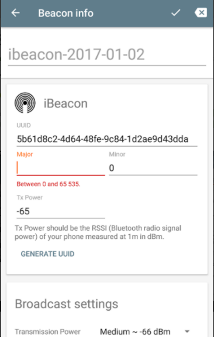

 

# Introduction, Integration and SDK - v4.0.0

[TOC]

 
 

# Scope
In this section of the documentation we describe how to create the conditions required to start developing and integrating the SDK. It also describes what to expect in terms of outcome from the sample application and SDK during development and before starting field trials. 

 
 

# Glossary
| Term | Meaning |
|:---:|---|
| IDE | Acronym for Integrated Development Environment. |
| Android Studio | Android app development IDE. |
| Beacon | BLE sensor device that sends data packets. |
| BLE | Acronym for Bluetooth Low Energy. BLE is a wireless personal area network technology designed and marketed by the Bluetooth Special Interest Group aimed at novel applications in the healthcare, fitness, beacons, security, and home entertainment industries. |
| CMS | Acronym for Content Management System. |
| GPS | Acronym for Global Positioning System. |
| Heading | Synonym of ‘Orientation’. |
| Host app | Application hosting PenguinIN’s SDK. |
| JSON | A data exchange format, Acronym for JavaScript Object Notation. |
| Orientation | The direction where the mobile is heading. |
| OS | Acronym for Operating System. |
| UI | Acronym for User Interface. |
| Wi-Fi | Technology that uses radio waves to provide network connectivity. |
| X-coordinate | Horizontal coordinate in a grid. |
| Y-coordinate | Vertical coordinate in a grid. |
| Z-coordinate | Depth coordinate. |
 
 

# Before Beginning

The application developer receives and SDK and a companion sample mobile application which integrates the SDK and shows additional basic functionality including presenting location on map and navigation. However, in order for the sample application to run, there must be a BLE beacon present and configured correctly with the parameter in the table below:

| Paramter | Value |
|:---:|---|
|Protocol | iBeacon |
|UUID | A2C56DB5-DFFB-48D2-B060-D0F5A71096E0 |
|Major| 500 |
|Minor| 2 |
|Tx Power| -65 |

In the likely event that the application developer does not have a physical beacon, then one of many a simulator beacon tools can be used.  Below is an example of such a tool and the steps used to configure this tool with the above parameters. 

- Download the following app from the Android play store (Apple alternatives exist):
   
  
     

  -	Add new Simulated beacon:
   
       
   
   
   

  

  

Now the beacon has been correctly configured, we are ready to move to the next section showing how to leverage the sample app and to configure the SDK.

